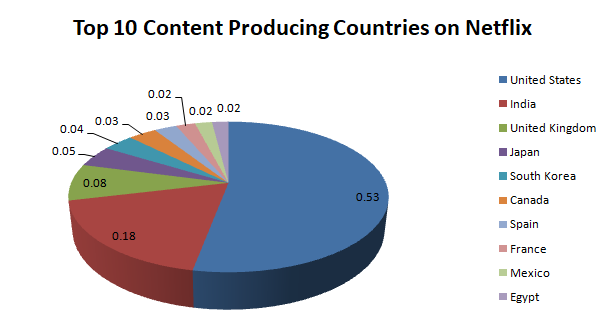

# Netflix Content Strategy & User Insight Analysis using SQL

  

## Project Overview

This project focuses on analyzing Netflix’s content library using SQL to uncover insights using Microsoft Excel.
The objective is to understand trends in content types, genres, release patterns, and market contributions to support data-driven decision 
making.

## Tools Used

- PostgreSQL  
- SQL  
- Microsoft Excel 

## Problem Statement

With the rapid growth of streaming platforms, understanding content trends, audience preferences, and regional production patterns has become essential for data-driven decision making.  
Netflix continuously expands its content library, making it important to analyze how content types, genres, release trends, and country-wise contributions evolve over time.

This project aims to analyze Netflix’s content dataset using SQL to identify meaningful insights that can support content acquisition and production strategy.

## Dataset

The dataset used in this project is sourced from Kaggle and contains information about Netflix movies and TV shows, including details such as title, type, genre, release year, country, rating, and date added to the platform.

**Dataset Link:**  
https://www.kaggle.com/datasets/shivamb/netflix-shows

## Database Schema

The dataset was imported into PostgreSQL and structured into a single table containing the following key columns:

- show_id  
- type (Movie / TV Show)  
- title  
- director  
- cast  
- country  
- date_added  
- release_year  
- rating  
- duration  
- listed_in (genre)  
- description  

Basic data cleaning was performed, including handling null values, standardizing formats, and splitting multi-value fields where required.

## Business Questions

This analysis aims to answer the following business-driven questions:

1. What is the overall distribution of Movies versus TV Shows on Netflix?  
2. How has Netflix’s content addition trend changed over the years?  
3. Which genres dominate Netflix’s content catalog?  
4. Are certain genres more commonly produced as TV Shows rather than Movies?  
5. Which countries contribute the highest number of titles on Netflix?  
6. How has country-wise content production evolved over time?  
7. What content ratings (TV-MA, PG-13, etc.) are most prevalent on the platform?  
8. Is Netflix increasingly focusing on mature audience content?  
9. What is the average release year distribution of Netflix content?  
10. Which directors have contributed the most content to Netflix?  
11. Which actors appear most frequently across Netflix titles?  
12. What proportion of Netflix content consists of documentaries?  
13. How does content duration vary across Movies and TV Shows?  
14. Which time periods saw major spikes in Netflix content expansion?  
15. What content characteristics are commonly associated with high-volume production?

## SQL Concepts Used

- Data filtering using WHERE conditions  
- Aggregations using COUNT, AVG, and GROUP BY  
- Subqueries for layered analysis  
- Common Table Expressions (CTEs)  
- Window functions for ranking and comparison  
- String functions for splitting multi-value columns  
- Date functions for time-based analysis  

## Key Insights

- Netflix’s content library is largely dominated by Movies; however, TV Shows have shown stronger growth in recent years. This indicates a gradual shift toward long-form and episodic storytelling.

- A significant rise in content additions is observed after 2016, aligning with Netflix’s global expansion phase. This period reflects increased investment in original and international productions.

- Drama and International content emerge as the most prominent genres on the platform. This highlights Netflix’s emphasis on emotionally driven narratives and region-specific storytelling.

- The United States and India contribute the highest number of titles to Netflix’s catalog. This suggests a strategic focus on both established entertainment markets and rapidly growing audiences.

- Mature audience ratings such as TV-MA dominate the platform’s content. This reflects Netflix’s preference for complex, bold, and adult-oriented themes.

- Over time, Netflix has diversified its catalog by increasing regional and non-English content. This approach supports stronger global audience engagement and cultural representation.

- Overall, Netflix’s content strategy demonstrates a balance between global scalability and localized production. Such a strategy allows the platform to cater to diverse audience preferences across regions.

## 📊 Data Visualization

### Movies vs TV Shows Trend by Year

### Top Genres on Netflix

### Top Content Producing Countries

## Insights from Data Visualization

### Movies vs TV Shows Trend by Year
- The visualization shows a sharp increase in Netflix content additions after 2015, indicating rapid platform expansion.  
- Movies dominated the platform in earlier years, while TV shows grew significantly in later years, reflecting a strategic shift toward episodic and binge-watch content.

### Top Genres on Netflix
- Drama emerges as the most dominant genre on Netflix, highlighting strong audience preference for story-driven content.  
- The presence of documentaries, stand-up comedy, and family-oriented content indicates Netflix’s strategy to diversify offerings across different audience segments.

### Top Content Producing Countries
- The United States contributes the largest share of Netflix content, followed by India and the United Kingdom.  
- This distribution reflects Netflix’s focus on both established entertainment markets and high-growth regional audiences.

## Conclusion

This project demonstrates how SQL can be used to analyze large-scale content datasets and extract meaningful business insights.  
Through structured querying and analytical reasoning, key trends related to content strategy, audience targeting, and regional production were identified.  
The findings highlight Netflix’s evolving focus on global expansion, mature audiences, and diversified content offerings.  
Overall, this analysis showcases the practical application of SQL in supporting data-driven decision making.
