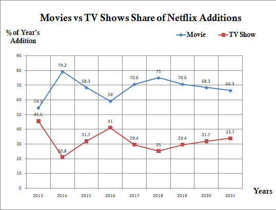
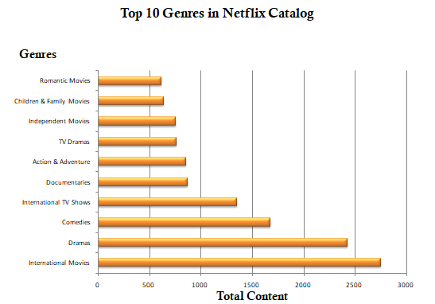
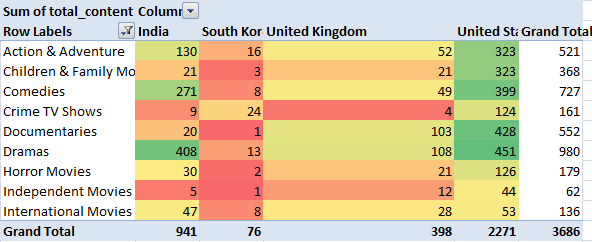
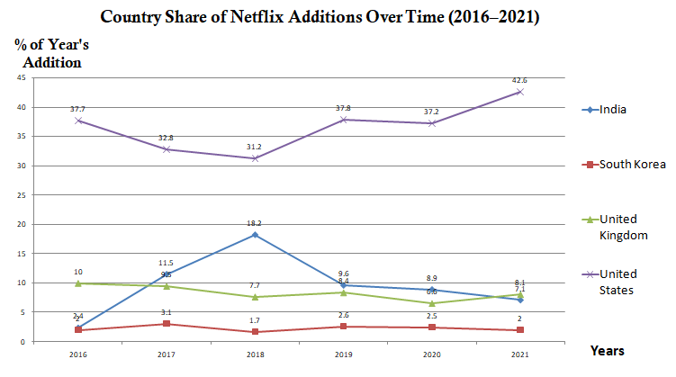
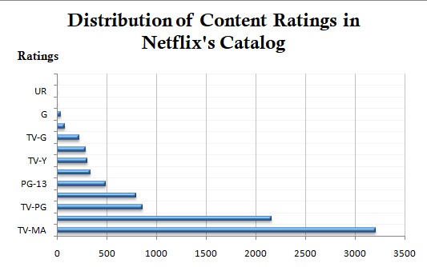
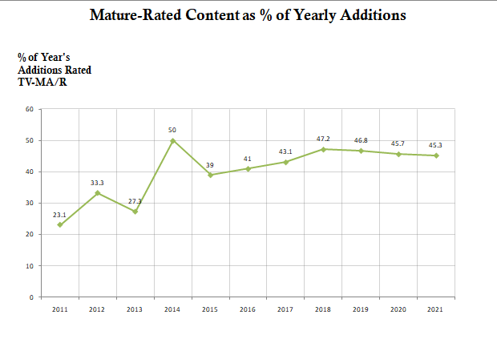
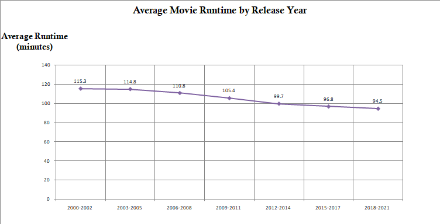
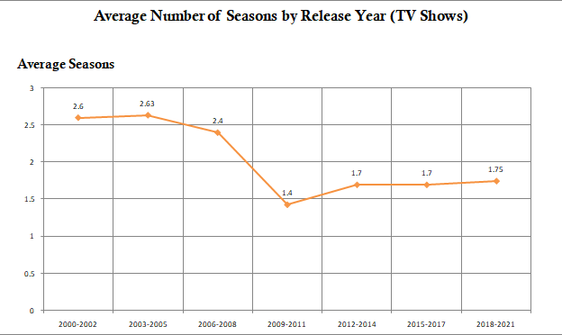
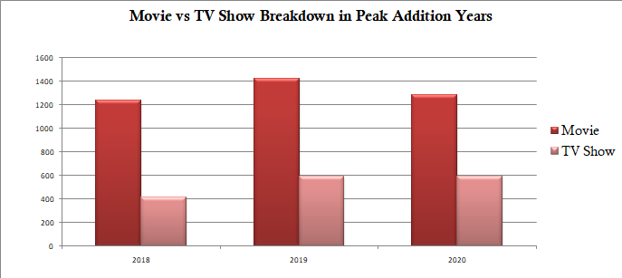
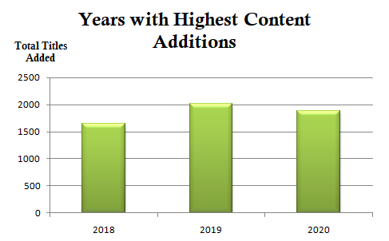

# Netflix Content Strategy Analysis using SQL

  

## Project Overview

This project analyzes Netflix's content catalog using SQL (PostgreSQL) for data extraction and transformation, and Microsoft Excel for visualization- including pivot tables, a country×genre heatmap, and an interactive KPI dashboard. The goal is to understand how Netflix's content mix, genre composition, country contributions, ratings, and content characteristics have evolved over time, based entirely on catalog metadata (what titles were added and when- not viewership or engagement data).

## Problem Statement

With the rapid growth of streaming platforms, understanding content trends and regional production patterns has become increasingly important for content strategy and planning. Netflix continuously expands its content library, making it valuable to analyze how content type, genre, ratings, and country-wise contributions have evolved over time.

This project uses SQL to query Netflix's content catalog and identify patterns that can inform discussions around content acquisition and catalog strategy.

## Dataset

The dataset used in this project is sourced from Kaggle and contains metadata on Netflix Movies and TV Shows, including title, type, director, cast, country, date added, release year, rating, duration, and genre.

**Dataset Link:**  
https://www.kaggle.com/datasets/shivamb/netflix-shows

## Database Schema

The dataset was imported into PostgreSQL and structured into a single table containing the following key columns:

- show_id  
- type (Movie / TV Show)  
- title  
- director  
- cast  
- country  
- date_added  
- release_year  
- rating  
- duration  
- listed_in (genre)  
- description  

Data cleaning performed:

Converted date_added from text to a proper DATE type to enable year-based time-series analysis
Identified and excluded 3 records where duration values ("66 min", "84 min", "74 min") had shifted into the rating field due to a source data misalignment
Standardized NULL handling across country, rating, listed_in, and date_added fields
Split multi-value fields (country, listed_in) using string-array functions where genre- or country-level analysis required it

## Data Limitations

This is a catalog/metadata dataset- it does not include viewing hours, completion rates, subscriber retention, or revenue. Because of this:

- All findings describe what Netflix added to its catalog and when- not what audiences watched, finished, or responded to. Terms like "growth," "share," and "dominance" refer to catalog composition, not audience engagement or content performance.
- Country and listed_in (genre) are Netflix's own multi-value tags, not audience-derived categories. Where both are unnested together (country × genre analysis), the result is a cross-product- a title tagged with 2 countries and 3 genres contributes to 6 combinations. This is called out explicitly where it applies.
- Years with very low title counts were excluded from percentage-based trend charts, since small samples produce unstable, non-representative percentages. Specific cutoffs are noted in each relevant analysis.
- date_added (when Netflix added a title to its catalog) and release_year (when a title was originally produced/released) are distinct fields, used deliberately depending on the question — see the note under each analysis section.

## SQL Techniques Used

- Data filtering using WHERE conditions
- Aggregation using COUNT, AVG, and GROUP BY
- Window functions (SUM() OVER (PARTITION BY...) for year-over-year percentage shares)
- String functions (STRING_TO_ARRAY, UNNEST) for splitting multi-value fields (country, listed_in)
- Date functions (EXTRACT(YEAR FROM date_added)) for time-based analysis
- Subqueries for filtering based on aggregated results (e.g., identifying top-volume years)

## Methodology Notes

date_added vs. release_year: These fields answer different questions and were used deliberately:

- date_added (when Netflix added a title to its catalog) was used for any question about Netflix's acquisition/catalog behavior- content mix over time, country contribution over time, mature-content share over time, and peak addition years.
- release_year (when a title was originally produced) was used only for the duration/runtime analysis, since that question is about content vintage, not when Netflix acquired it.

Small-sample exclusions: Years with very few titles produce unstable percentages (e.g., a single title added in a year makes that year's "% share" swing to 0% or 100%). The following cutoffs were applied to trend-based charts:

## Business Questions and Analysis

This analysis aims to answer the following business-driven questions:

Q1: How has the Movie-to-TV-Show mix of Netflix's catalog changed over time?

Note: Based on date_added (year Netflix added each title), not release_year. Years prior to 2013 were excluded due to very low title counts, which made percentage calculations unstable and non-representative.

Findings:

- Movies have consistently made up the larger share of Netflix's yearly additions, but that share has trended downward — from a peak of 79.2% in 2014 to 66.3% by 2021.
- TV Shows' share correspondingly grew from a low of 20.8% in 2014 to 33.7% by 2021, its highest point in this window.
- The shift has not been linear: Movie share dipped as early as 2016 (59%) before partially recovering through 2018 (75%), then resuming its gradual decline.
- Despite the shift toward TV Shows, Movies remained the majority of additions in every year observed — the catalog mix has moved toward more balance, not toward TV Show dominance.

Q2: Which genres dominate Netflix's catalog, and how does genre composition differ by country?

Note: Genre counts reflect tag frequency, not title count — most titles carry multiple genre tags (listed_in is multi-value), so totals exceed the number of unique titles. The country × genre breakdown further unnests both fields together, creating a cross-product: a title tagged with 2 countries and 3 genres contributes to 6 country-genre combinations. Totals here should be read as "how often this combination appears," not as unique title counts.

Findings:

- International Movies (2,752) and Dramas (2,427) are the two most frequently tagged genres in the catalog, followed by Comedies (1,674) and International TV Shows (1,351).
- Movie-oriented genre tags dominate the top 10 overall— 6 of the top 10 genres are Movie-flavored (International Movies, Dramas, Comedies, Action & Adventure, Independent Movies, Children & Family Movies) versus TV-flavored tags further down the list- consistent with Q1's finding that Movies still make up the majority of the catalog.
- Genre composition varies notably by country: India's catalog leans more heavily toward Action & Adventure (130 titles) relative to its overall size compared to South Korea (16) or the UK (52), and also carries a larger Comedies count (271) than the other three countries combined.
- Dramas is the most consistently represented genre across all four countries, appearing as a leading category in India, the UK, and the US alike.

Q3: Which countries contribute the most content, and has that concentration changed over time?

Note: Based on date_added. Limited to the top 4 contributing countries (United States, India, United Kingdom, South Korea) for readability; years prior to 2016 were excluded due to low title counts for several of these countries in earlier years.

Findings:

- The United States has consistently been the largest single contributor to Netflix's catalog additions, but its share has fluctuated rather than followed a clear trend — dropping from 37.7% (2016) to a low of 31.2% (2018), then rising back to 42.6% by 2021, its highest point in the window.
- India's share peaked at 18.2% in 2018 before declining to 8.1% by 2021- a distinct rise-and-fall pattern, unlike the US's fluctuation.
- The United Kingdom and South Korea each remained in the single digits throughout the period, with no substantial change in their relative contribution.
- This data does not support a narrative of Netflix reducing its reliance on the US market. The most recent year in the dataset (2021) shows the highest US concentration observed across the entire 2016–2021 window.

Q4: What content ratings are most common, and has mature-rated content grown as a share of additions?

Note: Based on date_added for the trend chart. 3 records with corrupted rating values were excluded (see Data Limitations). Years prior to 2011 were excluded from the trend chart due to low title counts.

Findings:

- TV-MA is by far the most common rating in the catalog (3,207 titles), followed by TV-14 (2,160) and TV-PG (863)- mature and teen-oriented ratings substantially outnumber all-audience ratings like G (41) or TV-G (220).
- Mature-rated content (TV-MA/R) rose sharply as a share of yearly additions in the early-to-mid 2010s, from 23.1% (2011) to a high of 50% (2014).
- Since 2018, that share has plateaued in the 45-47% range and has shown a slight downward trend over the most recent three years observed (47.2% → 46.8% → 45.3%, 2018–2021).
- The data shows a rise-then-plateau pattern, not continuous growth. Mature content's share of additions is not still climbing as of the most recent year in this dataset- it has leveled off and ticked slightly down.

Q5: How does content duration differ by release vintage?

Note: Based on release_year (content vintage), not date_added- this question is about the content itself, not when Netflix acquired it. Titles released before 2000 were excluded due to very low annual volume, which produced unstable averages even when grouped into multi-year bins. Data is grouped into 5-year bins to smooth year-to-year noise.

Findings:

- Average movie runtime has declined steadily and consistently, from 115.3 minutes (2000-2002) to 94.5 minutes (2018-2021)- a drop of roughly 20 minutes, or about 18%, over two decades.
- Average TV show season count followed a different pattern: it fell sharply from 2.6 seasons (2000-2002) to a low of 1.4 (2009-2011), then stabilized around 1.7 seasons through 2021- the decline was concentrated in the earlier period rather than ongoing.
- Both formats show a "shorter content" pattern overall, but on different timelines: movie runtime has continued shrinking through the most recent bin, while TV season count leveled off roughly a decade ago.

Q6: Which years saw the highest volume of content additions, and were they driven more by Movies or TV Shows?

Note: Based on date_added. "Highest volume" here refers to raw totals, not year-over-year growth rate- a year can rank highly simply because Netflix's overall catalog was larger by then, not because it represented an unusual spike relative to prior years.

Findings:

- Netflix's three highest-volume addition years were 2018, 2019, and 2020- notably consecutive, suggesting a concentrated period of catalog expansion rather than isolated spikes.
- 2019 was the single highest year (2,016 titles added), followed by 2020 (1,879) and 2018 (1,649).
- Movies consistently drove these peak years, outnumbering TV Show additions by roughly 2:1 to 3:1 in each of the three years- consistent with Q1's finding that Movies remain the majority of additions throughout the catalog's history.

### Key Insights

- Movies remain the foundation of the catalog. They led every year of additions (Q1), dominate top genre tags (Q2), and drove peak-volume years by a 2:1–3:1 margin over TV Shows (Q6)- the mix is shifting toward TV Shows, but gradually, from a smaller base.
- Not every trend is a clean, ongoing trajectory. US content share and mature-content share both rose, then plateaued or partially reversed- 2021 shows the highest US concentration in the window, and mature content's share has ticked down over the last three years (Q3, Q4).
- Genre mix varies by country. India leans further into Action & Adventure and Comedies relative to its size than South Korea or the UK- regional strategy isn't uniform (Q2).
- Content is trending shorter, on different timelines. Movie runtime is still declining as of the latest data; TV season counts dropped sharply pre-2011 but have been stable since (Q5).
- Peak growth was concentrated, not gradual. The three highest-volume years (2018-2020) were consecutive, pointing to a defined expansion period rather than steady growth throughout (Q6).
  
## Business Recommendations

The following are strategic considerations suggested by catalog trends, not conclusions about audience demand or content performance- validating them would require viewership, retention, or revenue data this dataset doesn't include.

- Track the Movie-to-TV-Show mix shift- TV Shows' share is growing gradually, worth monitoring going forward (Q1).
- Investigate the recent US concentration uptick rather than assuming diversification is underway- 2021 shows the highest US share in the window (Q3).
- Explore whether regional genre differences reflect intentional localization- e.g., India's skew toward Action & Adventure and Comedies (Q2).
- Treat "shorter content" as two separate trends- movie runtimes are still declining, TV seasons have been stable for a decade (Q5).
- Use the 2018-2020 expansion period as a planning reference to understand what drove that growth, and whether to replicate it (Q6).

## Why This Project Matters

This project demonstrates how SQL and Excel can be used together to extract, clean, and analyze real-world catalog data- including handling data quality issues, choosing the correct time field for each question, and being explicit about what conclusions the data can and cannot support. These are foundational skills for any data analysis work, not just streaming platforms.

## Conclusion

This analysis examined Netflix's content catalog across six questions covering content mix, genre and country composition, ratings, duration, and growth patterns. The catalog has shifted gradually toward TV Shows while Movies remain dominant, genre and country contributions vary in ways that don't always follow a single clean trend, and content length has trended shorter on different timelines for Movies versus TV Shows.

Because this dataset covers catalog metadata only, these findings describe what Netflix added to its library and when- they are a starting point for strategic questions, not a substitute for viewership or performance data. Any next step from here would pair these catalog patterns with engagement or retention data to determine which parts of the catalog strategy are actually working.
