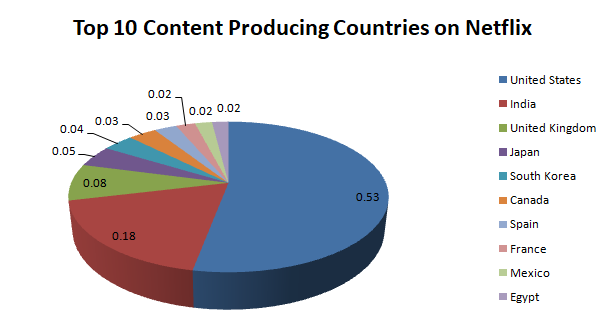

# Netflix Content Strategy Analysis using SQL

  

## Project Overview

This project focuses on analyzing Netflix’s content library using SQL to uncover insights and Microsoft Excel for data visualization.
The objective is to understand trends in content types, genres, release patterns, and market contributions to support data-driven decision 
making.

## Problem Statement

With the rapid growth of streaming platforms, understanding content trends, audience preferences, and regional production patterns has become essential for data-driven decision making.  
Netflix continuously expands its content library, making it important to analyze how content types, genres, release trends, and country-wise contributions evolve over time.

This project aims to analyze Netflix’s content dataset using SQL to identify meaningful insights that can support content acquisition and production strategy.

## Dataset

The dataset used in this project is sourced from Kaggle and contains information about Netflix movies and TV shows, including details such as title, type, genre, release year, country, rating, and date added to the platform.

**Dataset Link:**  
https://www.kaggle.com/datasets/shivamb/netflix-shows

## Database Schema

The dataset was imported into PostgreSQL and structured into a single table containing the following key columns:

- show_id  
- type (Movie / TV Show)  
- title  
- director  
- cast  
- country  
- date_added  
- release_year  
- rating  
- duration  
- listed_in (genre)  
- description  

Basic data cleaning was performed, including handling null values, standardizing formats, and splitting multi-value fields where required.

## SQL Techniques Used

- Data filtering using WHERE conditions  
- Aggregations using COUNT, AVG, and GROUP BY  
- Subqueries for layered analysis  
- Common Table Expressions (CTEs)  
- Window functions for ranking and comparison  
- String functions for splitting multi-value columns  
- Date functions for time-based analysis  

## Business Questions

This analysis aims to answer the following business-driven questions:

1. What is the overall distribution of Movies versus TV Shows on Netflix?  
2. How has Netflix’s content addition trend changed over the years?  
3. Which genres dominate Netflix’s content catalog?  
4. Are certain genres more commonly produced as TV Shows rather than Movies?  
5. Which countries contribute the highest number of titles on Netflix?  
6. How has country-wise content production evolved over time?  
7. What content ratings (TV-MA, PG-13, etc.) are most prevalent on the platform?  
8. Is Netflix increasingly focusing on mature audience content?  
9. What is the average release year distribution of Netflix content?  
10. Which directors have contributed the most content to Netflix?  
11. Which actors appear most frequently across Netflix titles?  
12. What proportion of Netflix content consists of documentaries?  
13. How does content duration vary across Movies and TV Shows?  
14. Which time periods saw major spikes in Netflix content expansion?  
15. What content characteristics are commonly associated with high-volume production?

## Analysis & Visual Insights

### Movies vs TV Shows Trend by Year

- Netflix content additions remained minimal until 2015, after which there is a sharp surge.
- Movie additions peaked at around 700–750 titles per year, while TV Shows crossed approximately 400 titles, indicating aggressive content expansion.
- While Movies dominated initially, the faster growth rate of TV Shows highlights a strategic shift toward episodic and binge-worthy content.

### Top Genres on Netflix

- International Drama leads with approximately 350+ titles, followed closely by Documentaries and Stand-Up Comedy.
- Multiple genres such as Kids TV and Family Movies each contribute around 200+ titles, indicating diversified content offerings.
- The distribution reflects Netflix’s strategy to balance high-demand genres with niche audience segments.

### Top Content Producing Countries

- The United States contributes over 50% of total content, making it the dominant production hub.
- India follows with approximately 18%, while the United Kingdom contributes around 8% of total titles.
- Other countries individually contribute less than 5%, showing a concentration of content production in a few key markets.

### Key Insights

- Netflix experienced rapid expansion after 2015, with content additions increasing multiple-fold, reflecting global scaling efforts.
- There is a clear transition from movie-heavy content to increased investment in TV Shows, driven by engagement and retention strategies.
- Content strategy is heavily centered around international and diverse genres to appeal to a global audience base.
- The platform relies significantly on a few major markets (US, India), while gradually expanding into regional production.
- Overall, Netflix is balancing large-scale global reach with localized storytelling to maximize audience engagement.

## Business Recommendations

- Increase investment in TV Shows, as their growth trend (400+ titles annually) indicates higher engagement potential.
- Continue expanding international content, especially in high-growth markets like India, to strengthen global reach.
- Focus on high-performing genres such as International Drama (350+ titles) and Documentaries for better audience retention.
- Reduce over-dependence on the US market (>50%) by diversifying production across more countries.
- Use data-driven insights to tailor regional content strategies and improve market penetration.

## Why This Project Matters

This project demonstrates how SQL-driven analysis can support strategic decision-making in content platforms by identifying trends, audience preferences, and growth opportunities.

## Conclusion

This project demonstrates how SQL and Microsoft Excel can be effectively used to analyze large-scale content datasets and generate actionable business insights. By performing structured querying in PostgreSQL and visualizing trends using Excel, key patterns in Netflix’s content strategy were identified.

The analysis revealed rapid content expansion after 2015, a strategic shift toward TV Shows, strong dominance of international and drama-based genres, and heavy reliance on major production markets like the United States and India.

These findings highlight Netflix’s focus on global scalability, audience engagement, and diversified content offerings. Overall, this project showcases the practical application of data analysis techniques in supporting data-driven decision making within the entertainment industry.
